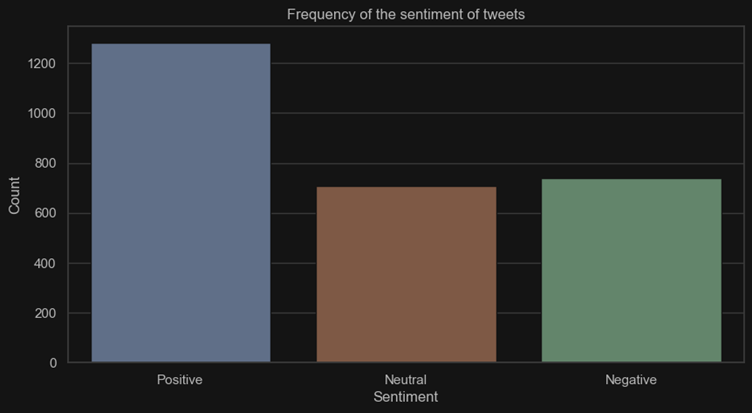
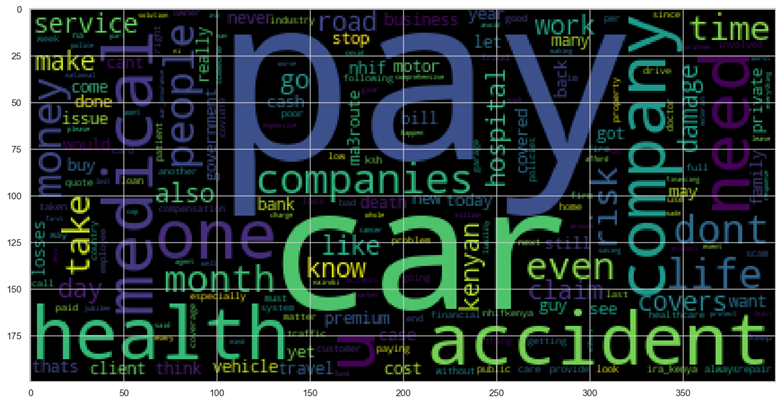
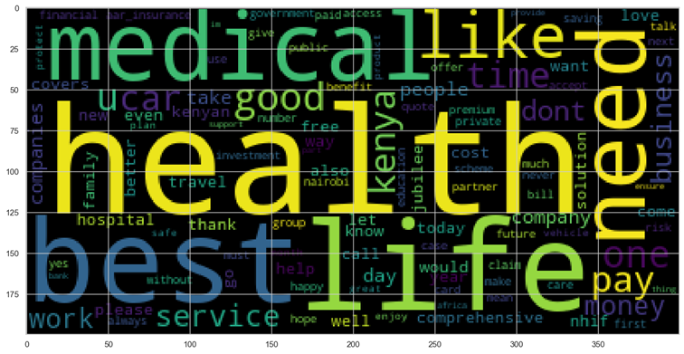
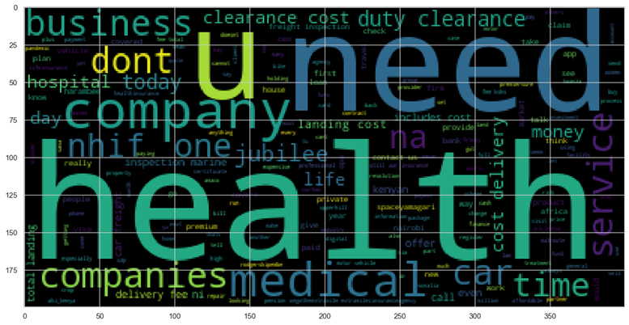

# Sentiment Analysis of Insurance in Kenyan Twitter

This project analyses the sentiment of insurance in Kenyan Twitter. This analysis aims to gain insights into how Kenyan Twitter users feel about insurance. The analysis will be based on data collected from the Twitter API and will use Python for data wrangling and analysis.

## Hypothesis

Based on prior knowledge, I have the initial hypothesis that Kenyan Twitter users generally have negative sentiments towards insurance, due to mistrust in the insurance industry and high premiums.

## Data Collection

I collected tweets using the Twitter API, using a combination of keywords related to insurance and Kenya. We collected tweets from 1st January 2020 to 31st December 2023, resulting in a dataset of approximately 2,700 tweets.

## Data Wrangling and Analysis

I cleaned and processed the data using Python, and used Natural Language Processing techniques to analyse the sentiment of each tweet. I used the VADER library to perform sentiment analysis, which assigns a polarity score to each tweet (-1 for negative sentiment, 0 for neutral, and +1 for positive sentiment).

## Results

The analysis revealed that the initial hypothesis was not correct. Kenyan Twitter users have slightly positive sentiments towards insurance, with an average polarity score of 0.11. However, negative sentiments were marginally higher than negative comments. The table below shows a summary of the sentiments recorded.

| Sentiment | Count | Percentage |
|-----------|-------|------------|
| Positive  | 1283  | 47%        |
| Neutral   | 706   | 26%        |
| Negative  | 740   | 27%        |

## Visualisations

I created several visualizations to gain a better understanding of the data.

*Figure 1: Distribution of Sentiment Scores in Kenyan Insurance Twitter Data*

*Figure 2: Word Cloud of Negative Kenyan Insurance Tweets*

*Figure 3: Word Cloud of Positive Kenyan Insurance Tweets*

*Figure 4: Word Cloud of Neutral Kenyan Insurance Tweets*

## Conclusion

My analysis provides valuable insights into how Kenyan Twitter users feel about insurance. The positive sentiment towards insurance suggests that insurance companies need to focus their marketing efforts on health insurance and life assurance products. 
Negative sentiments however seemed to be towards motor insurance and partly towards health insurance. In addition, the negative sentiments were partly due to delayed claim payments and lack of coverage against some medical bills. The issues raised by Kenyan Twitter users highlight that insurers need to improve their customer service and develop alternative products that cover most medical bills for the consumers 
The analysis shows that the majority of the tweets related to insurance from Kenyan Twitter users were positive. This could indicate that there is generally a positive perception of insurance in Kenya. However, it is important to note that this analysis was conducted on a small sample size and may not be representative of the entire Kenyan population.

## Future Work

Future work could involve analyzing the sentiment of insurance on other social media platforms to compare and contrast the results. Additionally, it could be interesting to explore the reasons behind the negative sentiment towards insurance and how insurance companies can address these concerns.
